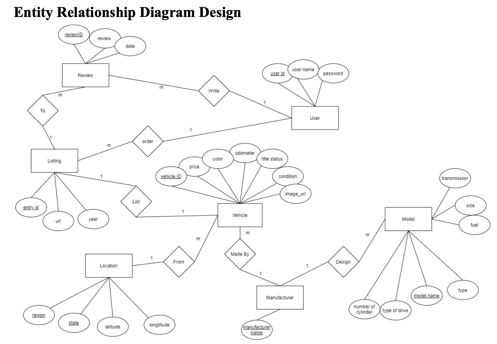
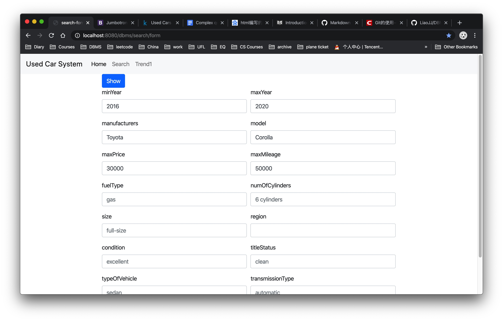
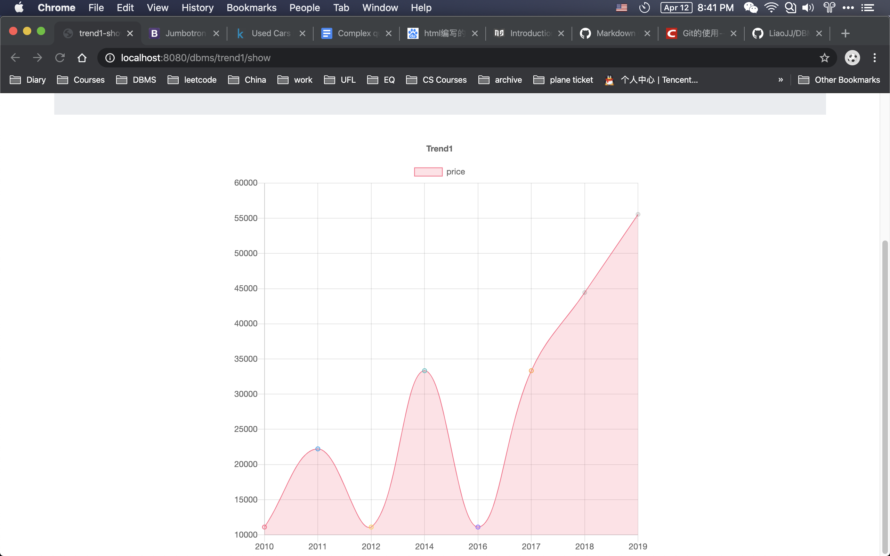
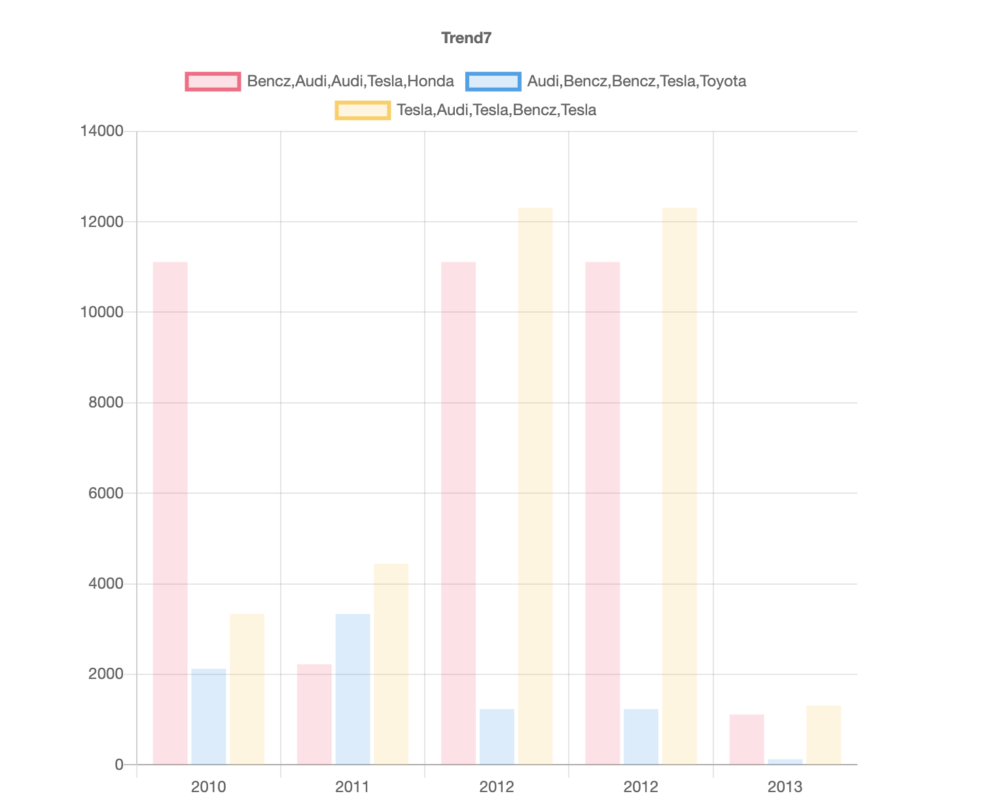

## COP 5725 Database Management Project: Used Car Management System

## https://dbms-m2r5.onrender.com/showamount?

In this project, we build a used car management system, we grab the data from [Used Cars Dataset of Kaggle](https://www.kaggle.com/austinreese/craigslist-carstrucks-data), we design the E-R diagram, UI Interface and SQL Database Schema. Then, we implement it by Java, Spring Boot and MySQL.

The concentration of this project will be displaying the insight of databases. We display 7 trending charts using customized SQL query to display some useful insights of the data.


In the Form part, I implement a Dynamic List/dropdown selector, which will reflect all options in the Database on time. I also add a Full-text search module. I implemented it based on the idea of Elastic Search, using a inverted index for quick full-text search.

Meanwhile, I use Maven to manage the package and compile. Also, I use Docker and Dockerfile to standard the deployment processes. Then, I deploy it on Heroku [here](https://dbms-jiajing.herokuapp.com/showamount).

(This project was originally based on Oracle Database, then I modified it to MySQL for cheaper deployment.
)

## Technology Stack
- Spring Boot, Java
- MySQL, JPA, Hibernate
- Thymeleaf, Bootstrap, HTML, JavaScript
- Maven, Docker, Heroku, Shell

## RESTful API Examples

Form-based Search:

[/search/form](https://dbms-jiajing.herokuapp.com/search/form)

Full-text Search: 

[/search/elastic](https://dbms-jiajing.herokuapp.com/search/elastic?q=Toyota+2016)

For Trending Query:

[/trend/form/1](https://dbms-jiajing.herokuapp.com/trend/form/1)        

[/trend/show/1](https://dbms-jiajing.herokuapp.com/trend/show/1?minYear=2000&maxYear=2020&condition=EXCELLENT&modelName=&status=CLEAN&fuel=GAS)

## Report 
This is our 3 reports to this project

[Report 1: high-level design](deliverable/Design.pdf)

[Report 2: User Interface Design and ER diagram](deliverable/User%20Interface%20Design%20and%20ER%20diagram.pdf)

[Report 3: Database Schema Construction](deliverable/Database%20Schema%20Construction.pdf)

## Function Model Explanation


-------------------------------------------


## Elastic Search

#### What is Elastic Search
Elastic Search is built on Apache Lucen, it is a full-text search engine, it uses inverted index for quick full-text search, it store data in a JSON format, and it support convenient sharding and replica. Basically it maintaines a HashMap, the key is word, and the value is the id of content, for every search key word, it will check the HashMap for the ids including these key word. And Finally, it will sort them by similarity and output it. Elastic Search supports many kinds of query style. It also suppots very good visulization tool, Kibana, and data filter tool, Logstash.

Steps
- start a Elastic Search Server by start.sh
- Initialization: Insert and build Index, (This part could be done by Python)
- Provide Endpoint for search
- Display results by WebPages

#### Problems
Elastic running on Heroku will leads to Memory exceeds and Elastic Search add-on is expensive on Heroku, I can only implement a simpler version by myself.

#### My Simple Elastic Search Design
Build Phase, maintain 2 HashMap, update them for every input
- Map<String, Set<String>> word2idList
- Map<String, String> id2text

Search Phase, calculate the score for every id, and output the sorted results
- Map<String, Integer> id2score
- then sort by score and display the 100 text with biggest score


-------------------------------------------

## Deployment 

https://dbms-jiajing.herokuapp.com/showamount

## steps
```
mvn clean package
docker build -t aaa .
docker run -it -p 8181:8181 aaa

java -Dserver.port=8181 -jar ./target/boot-0.0.1-SNAPSHOT.jar
```


-------------------------------------------

## MySQL
```
show databases;
create database Mybatis;
use Mybatis;
GRANT ALL ON *.* TO 'root'@'localhost';
```

#### connect to a remote server
```
mysql --protocol=tcp --user=root --password=12345678 --host=localhost --port=3306
docker exec -i 3b83d0e6eae9 sh -c 'exec mysql -u root --password=12345678 Mybatis ' < /Users/ljj/Documents/Courses/CS/DBMS/proj/UsedCar.sql
```


#### MySQL Problems:

#### Remote MySQL
It's case sensitive, so I have to configure IgnoreCase in Repository
Create table by .sql file, change it to uppercase by shell `dd if=input.txt of=output.txt conv=ucase`
Then change all SQL in Source Code to Uppercase

#### Username and password wrong
This was usually caused by exceeds the max connection, remember to close connection after using.


##### cannot connect MySQL in Docker:
need to wait for several seconds for initializing of MySQL
use a start.sh to sleep 10 seconds


##### MySQL Table Name Case Sensitive Problem:
- lower-case-table-names=1
- add above line to my.cnf file


-------------------------------------------

## Docker

## Docker Description for interview
Docker is a  tools for deployment. It consist of 3 components. Images, Container, and DockerHub.
Docker is a minimized virtual machine, which could help deployment.
- Images is a pack of a files, and it is the standard deployment file
- Container is running images, engineer need to monitor and maintain many container
- DockerHub is somewhere to download and upload Images, we can build our own images based on these images from DockerHub
Dockerfile is a standard way to generate Images and deployment applications. Dockerfile is consist of many lines. Every line will be executed and generated a images based on previous results.
Dockerfile is like a layered structure.
When we deploy our program, all we need is source code and Dockerfile.

#### useful command
```shell script
docker rm -f $(docker ps -a -q)
docker run -d -p 3306:3306 mysql:5.7
docker run -e MYSQL_ROOT_PASSWORD=12345678 -d -p 3308:3306 mysql --lower-case-table-names=1
docker run -d -it  -e MYSQL_ROOT_PASSWORD=12345678 -e MYSQL_DATABASE=Mybatis mysql:5.7 --lower-case-table-names=1
docker exec -it ea855b511660 /bin/bash
```


-------------------------------------------

## Heroku

#### how to publish them to heroku: 

https://devcenter.heroku.com/articles/container-registry-and-runtime
```
heroku container:push web
heroku container:release web
heroku open
heroku logs --tail
```

#### How to make Heroku alwasy running
- create a Google Sheets
- click Tools -> Script Editors
- start a new editor, copy below code
```javascript
function myFunction() {
  var d = new Date();
  var minutes = d.getMinutes();
  var hours = d.getHours();
  var currentTime = d.toLocaleDateString();
  var counter = SpreadsheetApp.getActiveSheet().getRange('B1').getValues();

  var response3 = UrlFetchApp.fetch("https://dbms-jiajing.herokuapp.com/showamount");
 
  if (hours >= 8 && hours <= 24) {
    var response = UrlFetchApp.fetch("https://yelp-camp-jack-liao.herokuapp.com/");
    var response2 = UrlFetchApp.fetch("https://react-expensify-jack-liao.herokuapp.com/");
    SpreadsheetApp.getActiveSheet().getRange('A1').setValue('Visted at ' + hours + ":" + minutes + ", " + currentTime);
    SpreadsheetApp.getActiveSheet().getRange('B1').setValue(Number(counter) + 1);
  }
}

```
- set a time-based trigger for myFunction, e.g. every 15 minutes
- Done.


#### How to bind the port 

#### Plan A
- application.properties: server.port=${PORT: 8181}
- Dockerfile: `CMD ["java", "-Xss512k", "-Xmx256m","-jar", "/app.jar", "--server.port=${PORT:8181}"]`

since heroku requires 60s to bind the port, however, the slow start of spring boot may exceed this time, below operations may be heliful
1. open https://dashboard.heroku.com/apps/dbms-jiajing/resources
2. close the project
3. reopen the project

Below line means success, but it still may exceeds 60 seconds limit, so try more times.
```shell script
java -jar /app.jar --server.port\=\$\{PORT:8181\}
```


#### PLAN B
Dockerfile:
```shell script
echo "PORT=$PORT" >> ~/.bash_profile
```

start.sh
```shell script
source ~/.bash_profile
echo "The port is "
echo $PORT

java -Xss512k -Xmx256m -jar /app.jar --server.port=$PORT
```

#### Volume exceed problem:
`error r14 (memory quota exceeded)`
ClearDB 5MB Limit: tailor the database to 1/4 size
Heroku: it still work though memory exceeds, but will be slower, and it will shutdown instead of sleep while idle
Solution: Configure JVM
`CMD ["java", "-Xss512k", "-Xmx256m","-jar", "/app.jar", "--server.port=${PORT:8181}"]`


## Deployment PLAN

### PLAN A: push spring-boot application, buy a extra service for MySQL
too expensive, only support 5MB data

#### Free Online MySQL
ClearDB only 5 MB, tailor my Database and then insert into ClearDB, works good
db4free, 200MB, but cannot set lower-case-table-names
Remote MySQL, 100MB, but cannot set lower-case-table-names
Amazon RD, not free
Google SQL, not free
Build by Heroku, complex and cost dyno time


#### PLAN B: put spring-boot and mysql in 1 container
cannot start mysql

use a start.sh, still cannot

use another abc.sh in background with sleep(delay), solved, but cannot deployed to Heroku. Since it requires ${PORT} binding, and this binding can only happen in CMD of Dockerfile, so it's impossible to deploy. 
When I tried it, it tomcat always listen to 8080 which means the $PORT is not binded correctly.
I guess the bind can only happend in CMD of Dockerfile, since the previous line of Dockerfile are generated beforehand, only the CMD last line will be executed in running time.

solutions:
- understand how to start mysqld in shell
- quit this problem and adopt Plan A. don't waste time.

This also not work for ElasticSearch when deploying to Heroku
- *** Error in `ps-run': realloc(): invalid pointer: 0x0000000000402349 ***
- Memory Exceeds


#### PLAN C: put spring-boot and mysql in 2 seperate container

how to connect them: docker network, docker-compose
    - docker-compose: connect 2 container in local, but cannot in heroku
    - heroku.yml, very hard to learn

how to connect them in heroku, not solved, don't waste time
- tried heroku container:push --recursive, push both web and db, however, it's still not working


## Pictures

E-R Diagram


search form page


trending results





## Future:

- Input Data is static, it should be dynamically crawlered from some website
- design RESTful API
- seperate Frontend and Backend, communicate by JSON data
- add Cache for list Query
- optimize Query efficiency
- add Page for Search Results


## Experiences

I waste too many time on plan picking and I even tried all the failed path. I deploy it more than 50 times. This waste me tons of time and I learn not really much. This is not reasonable.

What is correct is picking a workable and simple way, and then implement the workable solution. Do not waste time on useless details.

Waste your time on valuable things, not trivial details.

I should improve my scope and do not waste time on trivial details.


## Future Fix for Heroku Error (Persona notes)
- We use Render `https://dashboard.render.com/` to host our website since Heroku is no longer free. ~~heroku account is my 14gmail e-mail~~
- ~~We can not use Render PostgreSQL since my SQL command is not fully compatible with PostgreSQL. ~~
- all file could be downloaded from my personal Google Drive folder: https://drive.google.com/drive/u/0/folders/14IeXphs0ce0CJN28RI8w49TToOnGpIkJ

#### Steps to deploy again (on Heroku)
- `cd "/Users/ljj/Documents/Courses/CS/DBMS/proj/DBMS-Project-master"` (This is on my personal mac directory)
- we are using `https://freedb.tech/dashboard/`, go to this website to get SQL DB username and password, if this one no longer works, we can also switch to Render PostgreSQL, change in application.properties
- freedb.tech has a limit of 800 query/hour, so if it goes down, don't worry too much, it will be back soon. https://freedb.tech/dashboard/faq.php
- import everything from UsedCar-UpperCase.sql into https://remotemysql.com/databases.php, you may want to use DataGrip from JetBrains
- install a JDK, then `export JAVA_HOME="path to your JDK Home"`, for mac it's ` export JAVA_HOME="/Library/Java/JavaVirtualMachines/jdk1.8.0_221.jdk/Contents/Home"
`
- rebuild project using maven: `mvn clean package `, you may need export maven path with ` export PATH="/path-to-maven/apache-maven-3.9.0/bin:$PATH"`
  - you may also download a mvn here: https://maven.apache.org/install.html)
  - you may want change lombak version here: https://stackoverflow.com/questions/66801256/java-lang-illegalaccesserror-class-lombok-javac-apt-lombokprocessor-cannot-acce
- `docker build -t web . `
- follow steps in 'https://dashboard.heroku.com/apps/used-car/deploy/heroku-container' to release it, please release it with `container`.
- check Heroku modockerignorenitor status: https://script.google.com/home/projects/1LQY1WLhNfUvUiWFN9UoXmaPJhCsvUD3xA9VnFUSP2i4rASjFtO0clnmF/edit

#### Steps to deploy again (on Render)
- go to this website, https://dashboard.render.com/web/srv-cg5qqgseoogqpifmeop0/events, deploy by git last commit.
- Render does not deploy by Docker, it deploy by GitHub, so we have to leave the .jar file in github
- Render has a size limit, I have to compress the vehicles.csv to smallest, using `xz` format here instead of `gzip`, cmd: ` tar cv path/to/data | xz -9 > file.tar.xz`, referring here: https://superuser.com/questions/514260/how-to-obtain-maximum-compression-with-tar-gz